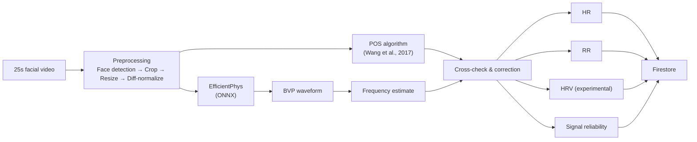

# PulseView

PulseView is an Android app that estimates **heart rate** and **respiratory rate** from a 25-second facial video recording — entirely on-device, no wearable hardware required. It's a research prototype built during an internship at [Twin Health](https://www.twinhealth.com), exploring remote photoplethysmography (rPPG) as a complementary measurement modality for Twin Health's digital twin platform.

**[Download the latest release →](https://github.com/Alpha-224/Pulseview/releases/tag/v1.0.0)**

---

## How it works

PulseView uses a technique called remote photoplethysmography (rPPG): the human face has a dense capillary bed beneath the skin, and each heartbeat causes subtle, periodic colour changes in facial skin — far too small to see with the naked eye, but detectable by a deep learning model trained on video.



### Why two algorithms?

EfficientPhys is a lightweight convolutional model that's small enough to run on a phone, but it can occasionally lock onto the wrong frequency in its output spectrum (e.g. a harmonic, rather than the true heart rate). The POS algorithm (Wang et al., 2017) is a much simpler, classical signal-processing technique that's slower but more robust to this specific failure mode. PulseView runs both: POS is used to correct EfficientPhys's frequency selection when they disagree, and the divergence between the two is used as a live signal-quality indicator shown to the user.

---

## Validation

The pipeline was validated at every stage against a Python reference implementation before being trusted on-device:

- **Preprocessing** (face crop, resize, diff-normalization) — validated bit-for-bit against the original Python pipeline on real captured video, after tracing and fixing two separate color-space bugs (a BGRA/RGBA channel swap, and a BT.601/BT.709 decoder mismatch).
- **FFT heart-rate calculation** — a from-scratch DFT implementation in Kotlin, validated to match `scipy.signal.periodogram`'s exact output (including its non-obvious power normalization convention) across multiple synthetic test frequencies.
- **POS algorithm** — ported from the original Python (including its `scipy.signal.filtfilt` zero-phase Butterworth filter, reproduced via the same edge-padding and steady-state initial conditions scipy uses internally) and validated against two independent synthetic test signals.
- **End-to-end accuracy** — cross-checked against a Garmin smartwatch across multiple real test sessions:

  | Recording length | PulseView HR | Garmin HR | Divergence |
  |---|---|---|---|
  | ~10s | 70 bpm | 66 bpm | 4 bpm |
  | ~20s | matched | — | ~1 bpm |
  | ~30s | exact match | — | 0 bpm |

  Accuracy improves with longer recordings, since the POS quality gate has more sliding windows to average across — the app enforces a fixed 25-second recording for this reason.

---

## Features

- **On-device inference** — no video or biometric data leaves the phone except the final computed metrics
- **Signal reliability indicator** — flags low-confidence readings (poor lighting, motion, divergent POS/model estimates) rather than silently reporting a bad number
- **Google Sign-In**, restricted to `@twinhealth.com` accounts, enforced both client-side and at the Firestore security-rules level
- **Scan history** with full clinical detail view (BVP waveform, POS quality gate comparison, model metadata) for any past recording
- **Trends over time**, gated behind a minimum of 3 distinct days of recordings — shown deliberately, since a trend line from a single day's noisy single-point reading would be misleading
- **Client-side data retention policy** — raw BVP waveforms (the most sensitive stored data) are cleared after 30 days, checked once daily at app launch

---

## Known limitations

- **HRV metrics are experimental.** RMSSD, SDNN, and pNN50 are computed and shown, but short-window, mobile-frame-rate (~20-25 fps) HRV estimation has a real, well-understood noise floor: a single frame of timing jitter at this frame rate corresponds to ±40-50ms of error per heartbeat interval, which propagates directly into these variability metrics. This isn't a bug — it's the same limitation the original Python pipeline's authors flagged, and it's why these fields carry an explicit "(Experimental)" label in the UI.
- **EfficientPhys, not RhythmMamba.** An earlier, desktop-only version of this pipeline used RhythmMamba (a Mamba state-space model), which is more accurate but uses custom CUDA kernels that don't export to mobile-compatible formats. EfficientPhys is a deliberate accuracy/portability trade-off for on-device use.
- **Single-device testing.** Built and tested on a Samsung Galaxy S24; broader Android device/version compatibility hasn't been verified.
- **Client-side data retention is best-effort,** not a server-side guarantee — a more robust implementation would use a scheduled Cloud Function rather than a check that only runs when a signed-in user opens the app.

---

## Tech stack

- **Inference:** ONNX Runtime Android, EfficientPhys (Liu et al., WACV 2023)
- **Computer vision:** OpenCV Android (face detection, image processing)
- **UI:** Jetpack Compose, Material 3
- **Backend:** Firebase Auth (Google Sign-In), Firestore
- **Camera:** CameraX

---

## Building from source

```bash
git clone https://github.com/Alpha-224/Pulseview.git
cd Pulseview
```

You'll need to provide your own:

1. **Firebase project** — create one at the [Firebase console](https://console.firebase.google.com), enable Authentication (Google provider) and Firestore, then download `google-services.json` and place it in `app/`
2. **Firestore security rules** — restrict access appropriately for your use case; see [`docs/firestore.rules`](docs/firestore.rules) for the exact rules used in production
3. **Signing key** (for release builds only — debug builds work without this):

```bash
   keytool -genkey -v -keystore release-key.jks -keyalg RSA -keysize 2048 -validity 10000 -alias pulseview
```

   Configure `keystore.properties` (not tracked in this repo) with your keystore path and credentials, referenced by `app/build.gradle.kts`'s `signingConfigs`.
4. **SHA-1 fingerprint** registered in your Firebase project, for both debug and release keystores (`./gradlew signingReport` to get the fingerprint)

Then:

```bash
./gradlew assembleDebug      # debug build, no signing needed
./gradlew assembleRelease    # release build, needs keystore.properties
```

---

## License

This is an internship research project. No license is currently specified — contact the repository owner before reuse.
